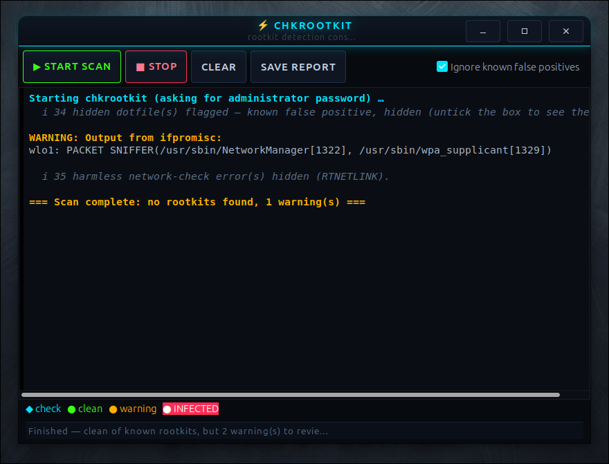

<div align="center">

<a href="https://github.com/effjy/chkrootkit-gui/"></a>

[](https://opensource.org/licenses/MIT)
[](https://en.wikipedia.org/wiki/C_(programming_language))
[](https://www.gtk.org/)
[](https://github.com/effjy/chkrootkit-gui/issues)
[](https://github.com/effjy/chkrootkit-gui/commits)

</div>

A friendly **GTK3** front-end for [`chkrootkit`](http://www.chkrootkit.org/) — runs a
rootkit scan and shows the results live, in a window, **with colors**, instead of a
wall of monochrome terminal text.

There are great rootkit scanners on Linux, but almost none of them present their
output in a way that's easy to read at a glance. This little C program fixes that
for `chkrootkit`.

## Screenshot



## Features

- **Live output** — each line appears as `chkrootkit` produces it, not all at once at the end.
- **Color-coded results:**
  - 🟢 **green** — clean (`not infected`, `nothing found`, `not found`)
  - 🟡 **yellow** — `Warning` / `vulnerable` / `suspicious`
  - 🔴 **red** — `INFECTED`
  - 🔵 **blue** — section headers (`Checking ...`)
- **"Ignore known false positives"** checkbox (on by default) that folds away the two
  notorious `chkrootkit` noise sources:
  - the repeated `RTNETLINK answers: Invalid argument` network-check errors, and
  - the long "suspicious hidden files" dotfile dump (legitimate config files like
    `.coveragerc`, `.htaccess`, `.npmrc`, …).

  Untick it to see the full raw output.
- **Live counters** in the status bar (infected / warnings).
- **Stop**, **Clear**, and **Save report…** buttons.
- Application icon + taskbar/window icon and a desktop menu entry.
- Runs `chkrootkit` through **`pkexec`** for the root password when you aren't already root.

## Requirements

- GTK 3 development files — `sudo apt install libgtk-3-dev`
- `chkrootkit` — `sudo apt install chkrootkit`
- `pkexec` (from `policykit-1`, normally already installed) for the password prompt
- A C compiler and `make`

## Build

```bash
make
```

## Run

```bash
make run          # build + run from this directory
# or, after installing:
chkrootkit-gui
```

Click **Start scan**. When you aren't root, a graphical password dialog appears
(via `pkexec`) because `chkrootkit` needs root to inspect the system.

## Install / Uninstall

```bash
sudo make install     # installs the binary, icon and menu entry under /usr/local
sudo make uninstall   # removes them
```

`make install` puts:

| File | Destination |
|------|-------------|
| `chkrootkit-gui` | `/usr/local/bin/` |
| `chkrootkit-gui.svg` | `/usr/local/share/icons/hicolor/scalable/apps/` |
| `chkrootkit-gui.desktop` | `/usr/local/share/applications/` |

After installing, the program appears in your application menu under
**System / Security**.

## Files

| File | Purpose |
|------|---------|
| `chkrootkit-gui.c` | The program (C / GTK3) |
| `Makefile` | Build, `run`, `install`, `uninstall` targets |
| `chkrootkit-gui.svg` | Application / window icon |
| `chkrootkit-gui.desktop` | Application menu launcher |

## Notes on false positives

`chkrootkit` is deliberately noisy — it flags *every* hidden dotfile in system
directories and emits harmless `RTNETLINK` errors during its network check. These
are almost always benign. A typical clean desktop reports dozens of "suspicious"
files that are simply normal config files. The **"Ignore known false positives"**
option exists precisely to keep that noise out of your way so genuine findings
stand out.

A `PACKET SNIFFER` warning naming `NetworkManager` / `wpa_supplicant` is also
normal on any laptop with Wi-Fi.

## License

MIT.
